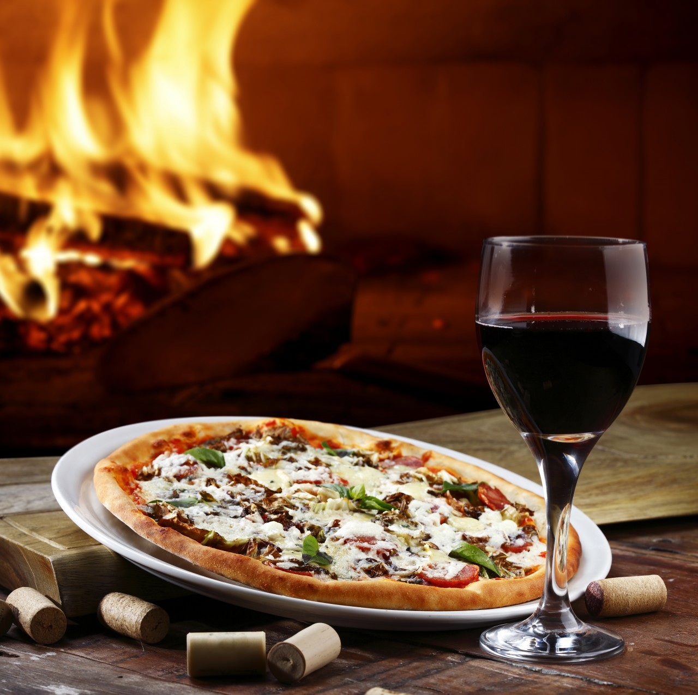
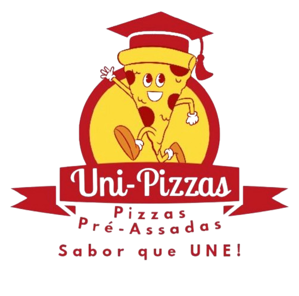

# 🍕 UniPizzas

> Projeto acadêmico de desenvolvimento web criado durante a graduação, com foco na apresentação de uma pizzaria, divulgação do cardápio e facilitação dos pedidos através do WhatsApp.

---

## 🎯 Sobre o projeto

O **UniPizzas** é um projeto desenvolvido durante a graduação como parte de uma atividade acadêmica voltada à criação de uma solução web para uma pizzaria.

A proposta foi desenvolver uma página moderna, organizada e visualmente atrativa para apresentar a identidade da UniPizzas, seus produtos e canais de contato.

O projeto também busca facilitar a comunicação com os clientes, permitindo que pedidos e solicitações sejam encaminhados diretamente para o WhatsApp da pizzaria.

---

## ✨ Funcionalidades

- 🏠 Página inicial com apresentação da UniPizzas
- 🍕 Seção de cardápio
- 💰 Exibição de preços
- 📝 Informações sobre os produtos
- 📦 Informações de quantidade, tempo de preparo e temperatura
- 📲 Pedidos direcionados diretamente para o WhatsApp
- 💬 Mensagens pré-preenchidas de acordo com a pizza escolhida
- 📱 Links para redes sociais
- 👥 Seção "Sobre Nós"
- 📞 Seção de contatos
- 🧭 Navegação entre as seções da página
- ✨ Efeitos visuais e animações de interação
- 📱 Layout adaptável para diferentes tamanhos de tela

---

## 🖥️ Demonstração

### 🏠 Página inicial



### 🍕 Cardápio

O site apresenta diferentes opções de pizzas, incluindo:

- 🍗 Frango com Catupiry
- 🌶️ Calabresa
- 🧀 Presunto e Mussarela
- 🍅 Marguerita

Cada produto apresenta informações como preço, quantidade de fatias, tempo de preparo e temperatura, além da opção de realizar o pedido pelo WhatsApp.

### 🏷️ Identidade visual



---

## 🛠️ Tecnologias utilizadas

| Tecnologia | Utilização |
|---|---|
| 🌐 HTML5 | Estrutura da página |
| 🎨 CSS3 | Estilização e layout |
| ⚡ JavaScript | Interações da interface |
| 🅱️ Bootstrap Icons | Ícones utilizados na interface |
| 🔤 Google Fonts | Tipografia |
| 📱 WhatsApp | Canal de pedidos e contato |
| 📸 Imagens | Identidade visual e apresentação dos produtos |

---

## 🎨 Interface

O projeto foi desenvolvido buscando criar uma experiência visual simples e agradável.

Entre os recursos utilizados estão:

- Navbar fixa durante a navegação
- Navegação suave entre seções
- Hero section com imagem de destaque
- Cards para apresentação dos produtos
- Efeitos de hover
- Botões de ação
- Layout utilizando Flexbox e CSS Grid
- Adaptação dos elementos para diferentes tamanhos de tela
- Organização visual baseada em seções

---

## 📲 Integração com WhatsApp

Um dos principais recursos do projeto é a integração direta com o WhatsApp.

Os botões de pedido utilizam links personalizados que já enviam uma mensagem pré-preenchida indicando a pizza escolhida.

Dessa forma, o usuário pode iniciar o contato com a pizzaria de maneira rápida e direta.

---

## 📁 Estrutura do projeto

```text
unipizzas/
│
├── index.html          # Estrutura principal da aplicação
├── style.css           # Estilos e layout da interface
├── script.js           # Interações da página
│
├── img/
│   ├── logo.png
│   ├── fundopizza.jpg
│   ├── calabresa.png
│   ├── frango.png
│   ├── marg.png
│   ├── pres.png
│   └── Quem somos nós.png
│
└── README.md           # Documentação do projeto
```

---

## 🎓 Contexto acadêmico

O UniPizzas foi desenvolvido durante a graduação como uma atividade prática de desenvolvimento web.

O projeto proporcionou a aplicação de conhecimentos relacionados à criação de páginas web, estruturação de conteúdo, estilização, organização de layouts e implementação de interações utilizando JavaScript.

Além dos aspectos técnicos, o projeto também envolveu a construção de uma identidade visual e a organização das informações de um negócio fictício.

---

## 🧠 Aprendizados

Durante o desenvolvimento do projeto, foram praticados conceitos como:

- Estruturação de páginas utilizando HTML5
- Organização e estilização utilizando CSS3
- Utilização de Flexbox e CSS Grid
- Criação de layouts adaptáveis
- Implementação de efeitos de interação
- Manipulação de elementos utilizando JavaScript
- Utilização de bibliotecas externas
- Integração de links com serviços externos
- Organização de arquivos em um projeto web
- Versionamento utilizando Git e GitHub
- Trabalho em equipe durante o desenvolvimento acadêmico

---

## 🚧 Próximas melhorias

Algumas funcionalidades podem ser implementadas futuramente para ampliar o projeto:

- [ ] Implementação de um carrinho de compras funcional
- [ ] Criação de uma página individual para cada produto
- [ ] Implementação de formulário de contato
- [ ] Melhorias na experiência mobile
- [ ] Implementação de sistema de pedidos
- [ ] Integração com banco de dados
- [ ] Criação de área administrativa
- [ ] Gerenciamento dinâmico do cardápio
- [ ] Implementação de autenticação de usuários
- [ ] Melhorias na acessibilidade
- [ ] Publicação da aplicação em uma plataforma de hospedagem

---

## 👩‍💻 Desenvolvedora

**Alice Vitória**

Estudante de **Sistemas de Informação** e desenvolvedora em formação, com interesse em desenvolvimento de software, programação e tecnologia.

Este projeto faz parte da minha trajetória acadêmica e do meu portfólio de projetos práticos.

---

## ⭐ Considerações

O UniPizzas representa uma experiência prática de desenvolvimento web e aplicação de conhecimentos adquiridos durante a graduação.

O projeto também serviu como oportunidade para trabalhar conceitos de interface, organização de conteúdo, integração com serviços externos e desenvolvimento colaborativo.

⭐ Se você gostou do projeto, considere deixar uma estrela no repositório!
